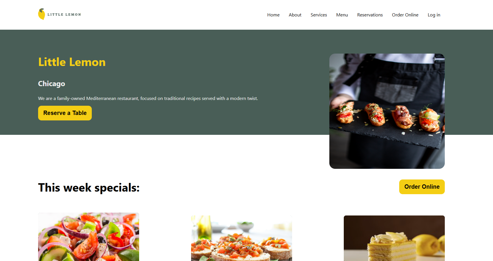
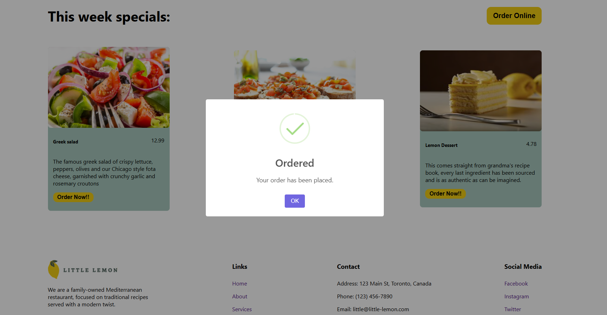
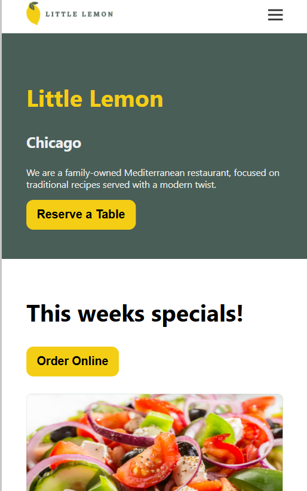

Little Lemon - Restaurant Booking Website
This is the final project for the Meta Front-End Web Development Professional Certificate on Coursera. In this certificate, I learned how to use React, HTML, CSS, JavaScript, version control with Git, and some UX/UI basics. Most of these skills have been applied to this final project.

The project is a website for a restaurant called Little Lemon. The website allows users to:

Check the menu

View contact information

Book a table in advance

This project was built using React and CSS, and I also used SweetAlert2 for nice-looking pop-up alerts.

Features
Menu: View a list of food items offered by the restaurant.

Reservations: Allows users to select a date, time, and number of guests to reserve a table.

Contact Information: Displays the restaurant's contact details.

Sweet Alerts: Attractive pop-up alerts for user actions.

Usage
Home Page: This is where the user can see the restaurant's branding and a call-to-action button to reserve a table.

Menu Page: Users can view the weekly specials offered by the restaurant.

Reservation Page: Users can select a date, time, number of guests, and occasion to reserve a table.

Example Screenshots:

Technologies Used
React: The core JavaScript library used to build the interactive user interface.

CSS: Used to style the app.

SweetAlert2: Used for creating pop-up alerts that are visually appealing.

JavaScript: For interactivity, form validation, and logic.

Git: For version control throughout the development process.